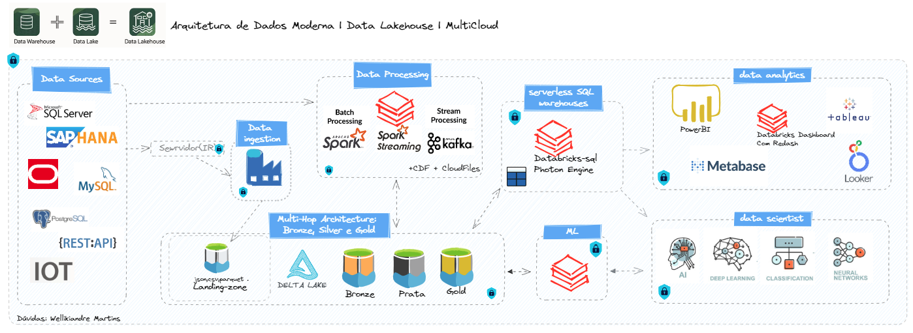
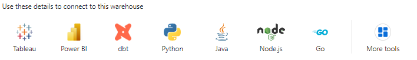
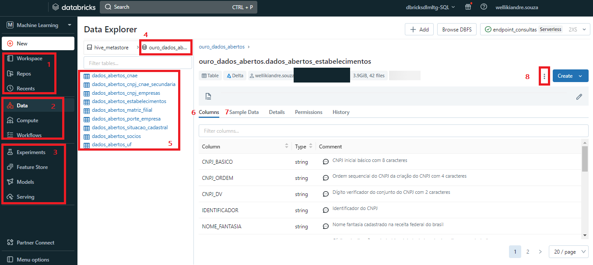

 
  

<h3 align="center">Arquitetura de Dados Moderna | Data Lakehouse | MultiCloud</h3>

  <a href="https://www.linkedin.com/in/wellikiandre/">
       linkedin Wellikiandre Martins
  </a>

<h5>&nbsp&nbsp&nbsp Neste projeto você encontrará um exemplo de uma arquitetura de dados moderna que pode ser utilizada em qualquer uma das 3 maiores cloud do mercado, sendo elas a AWS(Amazon), AZURE(Microsoft) e GCP(Google).
 &nbsp&nbsp&nbsp O principal objetivo do projeto é a democratização dos dados do seu negócio, uma criação de Data Lakehouse irá atender a área de análise e ciência de dados, alavanando o seu negócio, melhorando ou desenvolvendo novos produtos, para que a experiência do cliente sempre seja a melhor possivel.
</h5>

   
     
   

##  O que é Data Lakekouse? ##

&nbsp&nbsp&nbsp  Data Lakehouse é uma plataforma de análise de dados que combina os benefícios de um data warehouse com os de um data lake para fornecer uma solução de análise unificada. Ele permite que usuários extraiam, carreguem, transformem e analisem dados em uma única plataforma, aproveitando o melhor de ambos os mundos para obter resultados de análise mais robustos. A plataforma também oferece benefícios de governança, segurança e escalabilidade, permitindo que as organizações aproveitem melhor os dados.

####  Agora que sabemos o que é Lakehouse iremos abordar cada item na Arquitetura ####

## 1 : Data Sources ##

&nbsp&nbsp&nbsp  Data Sources são a origem dos dados que estão, ou serão coletados, na etapa de ingestão. Esses dados podem ser oriundos de sistemas transacionais onde mais de 90% dos dados são oriundos de aplicações web e dispositivos móveis.
  &nbsp&nbsp&nbsp  Outras fontes de origem são dados de sistemas de IoT e/ou dados de modelos de machine learning, além de fotos, videos entre outros; ou seja, tudo que possui input/entrada de informação é passível de coleta.

## 2 : Servidor ##

&nbsp&nbsp&nbsp  As vezes não podemos acessar o dado diretamente de sua fonte, para lidar com isso realizamos requisições em um servidor homologado que acessa esses bancos transacionais servindo de ponte na coleta dos dados.

## 3.1 : Ingestão de dados ##

&nbsp&nbsp&nbsp Nesta etapa podemos obter dados utilizando técnica de ingestão em batch ou streaming.
  &nbsp&nbsp&nbsp  Ingestão de dados batch é o processo de processamento de grandes quantidades de dados em grupos, ou "lotes". Geralmente acontece em uma transação única e os dados não estão próximos do tempo real.
  &nbsp&nbsp&nbsp Ingestão de dados streaming é o processo de processamento de dados no momento em que são gerados. É usado para processar dados em tempo real, o que significa que os dados são processados assim que são gerados ou em forma de microbatch utilizando técnica de insert/update.

## 3.2 : Transformação de dados ##

&nbsp&nbsp&nbsp A Transformação de Dados é um processo de transformar dados brutos em dados úteis para análise em uma camada de referência ou hierarquia. Na camada de Bronze, os dados são transformados para uma forma processável pela análise. Na camada de Prata, os dados são transformados para torná-los mais úteis para a análise. Finalmente, na camada de Ouro, os dados são transformados para serem usados ​​na tomada de decisão e na implementação de ações.

## 4 : Disponibilização ##
####  Ambiente Data Analytics ####

&nbsp&nbsp&nbsp Temos diversas formas de disponibilizar o dado nesta arquitetura: o ambiente serverless Databricks SQL é um ambiente de fácil uso para a área de negócio, analista de dados e analista de negócio. Este ambiente utiliza um cluster que possui conexão instantânea com os dados no Data Lake em todas as camadas, criando um ambiente de uso simples e direto com conexões para usuários que não sabem codar, onde facilmente se consegue plugar, com um clique, diversos aplicativos de Data Viz, como PowerBI, Tableau, etc. Além de um ambiente para execuções de SQL inclusive de forma gráfica.
 
   
 

####  Ambiente Data Science ########

&nbsp&nbsp&nbsp Todo acesso descrito no Ambiente de Data Analytics o Cientista tem acesso, além do Ambiente de Machine Learning onde o mesmo tem tudo o que é necessário para desenvolvimento e treinamento do seu modelo, conforme print abaixo segue um resumo do ambiente.
 
  

     
  

 

  <ol>
    <li> Nesta Localização é possível acessar os códigos , repositórios e os acessos recentes. </li>
    <li> Em data é possível acessar os dados, cluster e os fluxos de execuções</li>
    <li> Nesta área é possível utilizar todo o ambiente para data science</li>
    <li> Aqui pode selecionar o banco de dados</li>
    <li> Escolher a tabela de dados do banco de dados</li>
    <li> Visualizar as colunas da tabela com os tipos e dicionário de dados</li>
    <li> Exemplo dos dados na tabela</li>
    <li> Escolher se deseja utilizar o dado em um ambiente externo , interno, sql, Power BI, Python etc..</li>
  </ol>

Créditos Wellikiandre Martins ==> https://www.linkedin.com/in/wellikiandre/
